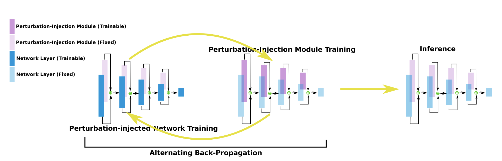

## Learn2Perturb: a noise injection method for adversarial robustness

(Pytorch)



This repository contains an implementation corresponding to our CVPR 2020 paper: "[Learn2Perturb: an End-to-end Feature Perturbation Learning to Improve Adversarial Robustness](https://arxiv.org/abs/2003.01090)". A brief presentation of our work is available at [this youtube link](https://youtu.be/KUJIDZo8azo).

If you find our work useful, please cite it as follows:
```bibtex
@inproceedings{jeddi2020learn2perturb,
  title={Learn2Perturb: an End-to-end Feature Perturbation Learning to Improve Adversarial Robustness},
  author={Jeddi, Ahmadreza and Shafiee, Mohammad Javad and Karg, Michelle and Scharfenberger, Christian and Wong, Alexander},
  booktitle={Proceedings of the IEEE Conference on Computer Vision and Pattern Recognition},
  pages={},
  year={2020}
}
```

This repository includes PyTorch implementation of:

- Adversarial attacks 
    - FGSM
    - PGD
    - C&W
    - EOT
    - one-pixel
- Baseline models used in experiments
- Learn2Perturb Modules

